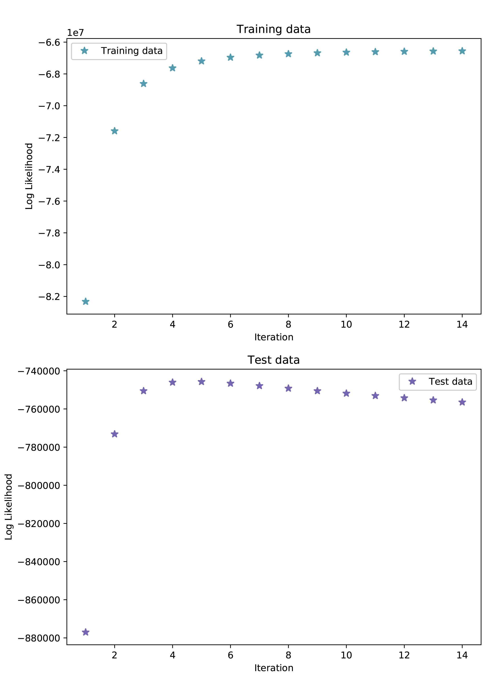

# IBM-model-1
Machine Translation using IBM Model 1

**Author:** Raiyan Abdul Baten

This project was done as part of a homework in the CSC448 Statistical Speech and Language Processing course at the University of Rochester.

## Task
Implement IBM Model 1, and plot log probability of training and test files.


## Usage Instruction

For the full data, only the log-likelihoods will be printed on the console. 
For the sample data, the exact output instructed in the m1.out file will be printed. 

- To run the program on the sample data, use the following command:
```
python3 ibm1.py sample
```

- To run the program on the full data, use:
```
python3 ibm1.py 
```


## Output plot



## Results on the full data
Please note that in the output_LL.jpg figure, iteration 0 is not plotted to make things visually pleasing.

**Iteration: 0**

LL computation on train data
-217797476.0647615

LL computation on test data
-2247465.8110379814

 
**Iteration: 1**

LL computation on train data
-82322062.6448161

LL computation on test data
-877048.3911503105

 
**Iteration: 2**

LL computation on train data
-71590595.2699113

LL computation on test data
-773171.1843272363

 
**Iteration: 3**

LL computation on train data
-68615880.03854483

LL computation on test data
-750535.8868777829

 
**Iteration: 4**

LL computation on train data
-67631110.28862412

LL computation on test data
-746060.422167845

 
**Iteration: 5**

LL computation on train data
-67193395.66792616

LL computation on test data
-745722.0504978022

 
**Iteration: 6**

LL computation on train data
-66962575.415640116

LL computation on test data
-746601.841278442

 
**Iteration: 7**

LL computation on train data
-66827009.52869792

LL computation on test data
-747860.9628666607

 
**Iteration: 8**

LL computation on train data
-66741010.01717139

LL computation on test data
-749208.5332690921

 
**Iteration: 9**

LL computation on train data
-66683161.57063999

LL computation on test data
-750542.960287484

 
**Iteration: 10**

LL computation on train data
-66642452.92880945

LL computation on test data
-751832.1431278088

 
**Iteration: 11**

LL computation on train data
-66612786.34104242

LL computation on test data
-753067.110097043

 
**Iteration: 12**

LL computation on train data
-66590528.29397569

LL computation on test data
-754247.0376401832

 
**Iteration: 13**

LL computation on train data
-66573416.16237401

LL computation on test data
-755376.3901200029

 
**Iteration: 14**

LL computation on train data
-66559987.31040166

LL computation on test data
-756461.235069733


